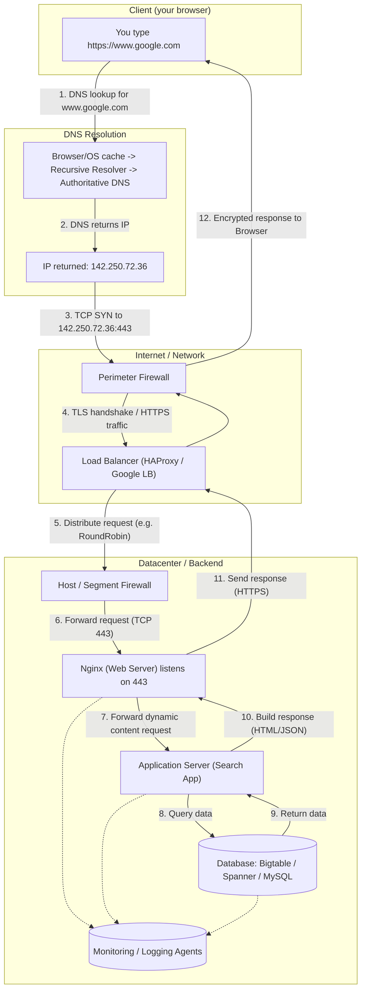

# Diagram: request flow when you type `https://www.google.com` and press Enter

Below is an integrated schema you can paste into a Mermaid-compatible editor (or adapt to Gliffy). It shows the full request flow and labels the key facts you asked for: DNS resolution, request hitting a server IP on the correct port, encrypted traffic (HTTPS/TLS), firewall traversal, load-balancer distribution, web server answering, application server generating the page, and that the application server requests data from the database.

> Tip: Gliffy is fine — if you prefer a drag-and-drop canvas, recreate the same boxes and arrows there. The Mermaid below is quick to paste into many Markdown editors and some diagram tools.

---

## Walkthrough (step-by-step, matching the diagram)

1. **DNS request (name → IP)**

   * Browser asks the local DNS resolver for `www.google.com`. The resolver walks the DNS hierarchy and returns an IP address. (Diagram: `DNS_RES` → IP.)

2. **Request hits server IP on the appropriate port**

   * The browser initiates a **TCP** connection to the returned IP **on port 443** (the HTTPS/TLS port). (Diagram: `B_out` → `FW1` labeled `TCP SYN to 142.250.72.36:443`.)

3. **Firewall traversal**

   * The packet passes through perimeter firewalls (and possibly additional segment/host firewalls). Firewalls enforce allow/deny rules (must allow outbound from client and inbound 443 to the load balancer/backends). (Diagram: `FW1`, `FW2`.)

4. **HTTPS / SSL (TLS) — traffic is encrypted**

   * The browser and server perform a TLS handshake (certificate validation, key exchange). All HTTP requests/responses are carried inside the encrypted TLS channel. The diagram marks the handshake and shows encrypted traffic in both directions.

   * Note: TLS can be **terminated** at the load balancer (LB) or passed through to backends. If terminated at LB, the LB holds the SSL cert and the LB ↔ backend leg may be re-encrypted or plaintext depending on configuration.

5. **Load balancer distribution**

   * The load balancer receives the TLS/HTTPS connection and forwards it to one of many backend servers based on its algorithm (round-robin, least connections, geo, consistent hashing). (Diagram: `LB` distributing to `Web` via `FW2`.)

6. **Web server handles the HTTP request**

   * The web server (e.g., Nginx) accepts the HTTP request, serves static resources directly, or proxies dynamic requests to the application server (via proxy_pass, FastCGI, uWSGI, etc.). (Diagram: `Web` → `App`.)

7. **Application server generates the web page**

   * The application runtime executes business logic (e.g., search query parsing, assembling search results), uses templates, and decides what data to fetch. (Diagram: `App`.)

8. **Application server requests data from the database**

   * The application issues queries to the database (reads/writes). The DB returns results, which the app uses to render the final response. (Diagram: `App` ↔ `DB`.)

9. **Response is returned (still encrypted) and rendered**

   * The generated HTML/JSON goes back through the web server, through the LB and firewalls, over the encrypted TLS session, to the browser, which decrypts and renders the page.

10. **Monitoring & observability**

    * Monitoring agents (collectors) on web/app/db servers send metrics and logs to a monitoring backend. Use these to track QPS, latency, errors, and detect outages (diagram: `MON`).

---

## Notes & practical considerations

* **Server IP example**: the IP `142.250.72.36` in the diagram is illustrative — actual IPs are dynamic and depend on DNS/load balancing.
* **Port**: HTTPS uses **443**; HTTP would use **80** (not shown here since you used `https://`).
* **TLS termination choices**: terminating at the LB simplifies cert management but may remove end-to-end encryption unless you re-encrypt to backends. Choose based on security/compliance needs.
* **Load balancer algorithm**: often Round-Robin, LeastConnections, or Geo-based routing; it influences client affinity, performance, and cache locality.
* **Firewalls**: include perimeter and host-level rules; they protect and segment the network.
* **Monitoring**: to track QPS, expose web/app metrics (nginx `stub_status` or Prometheus exporter) and build dashboards/alerts on the `requests_per_second` metric.

---

If you want, I can:

* produce a **Gliffy-ready diagram** (text description of shapes and connectors to paste into Gliffy),
* export a **Mermaid PNG/SVG** (if your environment supports rendering), or
* add a *sequence diagram* variant that shows the TCP/TLS handshake messages in detail.

Which would you like next?
